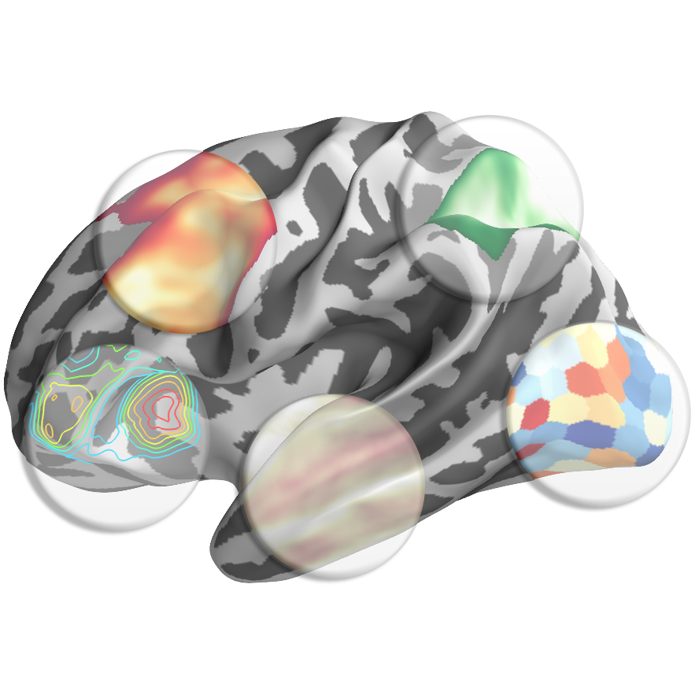

PySurfer
========

PySurfer is a Python package for interacting with a cortical surface
representations of neuroimaging data. It extends Mayavi's powerful
visualization engine with a high-level interface for working with MRI and MEG
data.

PySurfer offers both a command-line interface designed to broadly the
Freesurfer Tksurfer program and a Python library for writing scripts to
efficiently explore complex datasets and prepare publication-ready figures.

To goal of the project is to facilitate the production of figures that are both
beautiful and scientifically informative.

Important Links
---------------

- Official source code repository: https://github.com/nipy/PySurfer
- Online documentation (stable): http://pysurfer.github.com/
- NITRC page: http://www.nitrc.org/projects/pysurfer
- Freesurfer: http://surfer.nmr.mgh.harvard.edu/
- Mailing list: http://mail.scipy.org/mailman/listinfo/nipy-devel

Install
-------

This packages uses setuptools. To install it for all users, run:

    python setup.py build
    sudo python setup.py install

If you do not have sudo privileges, you can install locally:

    python setup.py install --home

For information about dependencies, please see the [online
documentation](http://pysurfer.github.com/install.html)

License
-------

Available under the Revised BSD (3-clause) license.

Testing
-------

You can launch the test suite by running `nosetests` from the source folder.

Another way to test is to build the documentation, which will run the example
scripts and automatically generate static image output. From the source
directory:

    cd doc/
    make clean
    make html

The resulting documentation will live at _build/html/index.html, which can be
compared to the online docs.

Either method will work only if you have Freesurfer installed on your machine
with a valid SUBJECTS\_DIR folder.
